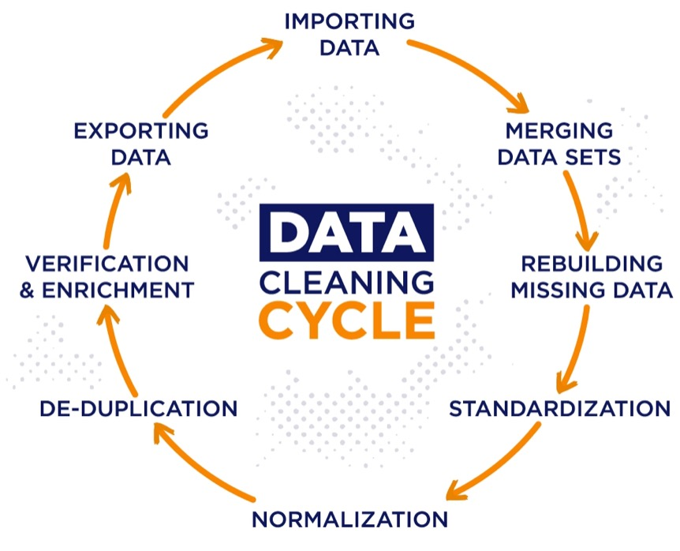
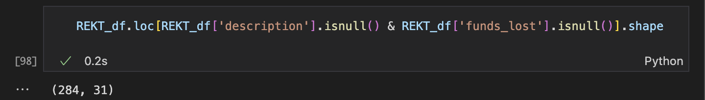
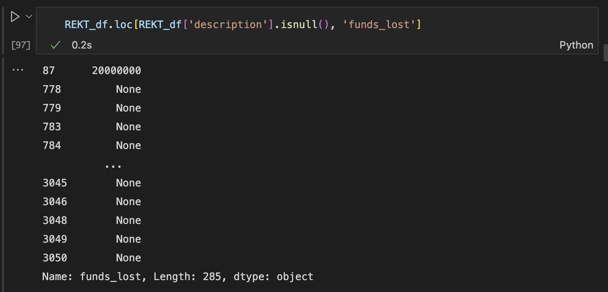

<style>
a:link {
    color: black;
}

a:visited {
    color: black;
}

 a:hover {
    color: blue;
}

</style>


[](https://www.iteratorshq.com/blog/data-cleaning-in-5-easy-steps/)

[REKT Database (Python)](https://github.com/anly501/anly-501-project-TegveerG/blob/main/codes/Data_Cleaning/REKT_Database_Cleaning.ipynb)
---

[**Raw Data (first 5 rows)**](https://github.com/anly501/anly-501-project-TegveerG/tree/main/data/Raw%20Data/Python_REKT_Database_API)

```{r rawREKT, echo=FALSE}
library(jsonlite)

rekt_raw <- read_json("../../data/Raw Data/Python_REKT_Database_API/REKT_Database_Python_API.json", simplifyVector = TRUE)

head(rekt_raw, 5)
```

After loading the record data and getting a quick view of it, we can move to cleaning/pre-processing the data. I first started with stripping off the whitespaces off the column names. Then, I went on to dropping variables that would not assist in our analysis. Most of the variables that we shall drop from our 31 columns are links to external sites, such as web archive, discord, and github. Moreover, these variables contain more than 2900 NaN values out of a total observation count of 3055. However, the variable proof_link could be important if I decide to scrape text data from the linked article about a crypto attack. We shall also get rid of the technical_issue field because it only contains 4 non-NaN values and, more importantly, does not have any insightful use. Therefore, I find it sensible to entirely remove these fields, instead of getting rid of their existing NaN values, for EDA and modeling purposes.

Next, we proceed to variable identification and typecasting, an important step to recognize what types of data our variables fit in.
For variables identified as Integer type, the summary is as follows:

*    `id` variable is a unique, nominal code indicating the token/coin associated with the crypto attack. Converting it to category type would not be beneficial due to the large number of unique tokens present in the database. **This variable should be converted to object/string type**. 

*    `active` variable most probably represents whether the crypto project is currently active in the market. I perused the API documentation to try to find this response variable's significance, but could not. Moreover, it has only taken on one as a value for ALL observations. This would mean that all crypto projects present in the database are still active. We could keep this variable for now, but **converting it to category would be better as it most likely would take on two values, either 1 (active) or 0 (inactive).**  

For variables identified as Object type, the summary is as follows:

*    Variables like `date`, `funds_lost`, and `funds_returned` are of type object. This means that **Pandas was not able to recognize the datatype** of these four variables. Therefore, we shall convert these aforementioned object data type variables to their respective datatypes. `funds_lost` and `funds_returned` are converted to floats and `date` is converted to pandas datetime.

For variables identified as Float type, the summary is as follows:

*   The `is_verified_source_code` and `is_public_team` variables take on the values of either 0 or 1. Hence, we convert them to category type.

***Extracting important time-based features for better EDA experience:***

The features from extracted are `month_of_attack`, `day_of_week_of_attack`, and `day_of_year_of_attack` from the raw date variable. 

***Removing HTML Tags from Description variable***

We also have to clean a vital text variable in our dataset that will be used in NLP tasks later. This is the `description` variable, which verbosely lays out the proof of the attack taking place and verified links to where the reader can obtain more information. In order to process this column, I made use of the Beautiful Soup library's `.get_text` function and passed it in a for loop that looped through the 'description' variable and appended processed outputs to the `REKT_df` data frame. 

HOWEVER, a crucial step was missing, which was that of getting rid of all the NaN's present in the `description` variable. This variable itself has 285 missing values, but when we add the  `funds_lost` variable in the mix, the total missing values is only 284. The `funds_lost`variable is a highly valuable attribute and, possibly, a target variable for modeling. We cannot get rid of even that single observation that has a `funds_lost` value but no description. Therefore, seen in the two screenshots below, we could not get rid of ALL NaN's present in the `funds_lost` variable and `description` variable.




The 284 rows were the only ones discarded while cleaning the dataset. Yes, there are missing values present in other rows, but we have done well to eliminate most, if not all, unnecessary data for EDA!

After all these above steps were completed, we come up with a cleaned data like this:

[**Clean Data (first 5 rows)**](https://github.com/anly501/anly-501-project-TegveerG/blob/main/data/Clean%20Data/REKT_Database_Clean_Python.csv)

```{r cleanREKT, echo=FALSE}
rekt_clean <- read.csv("../../data/Clean Data/REKT_Database_Clean_Python.csv")
rekt_clean <- subset(rekt_clean, select = -c(X))

head(rekt_clean, 5)
```

[Twitter Text (Python)](https://github.com/anly501/anly-501-project-TegveerG/blob/main/codes/Data_Cleaning/Twitter_API_cleaning.ipynb)
---

1. Count Vectorizer for Analyzing Cosine Similarity 

2. Regex -> `.str.lower().apply(lambda x: re.sub(r"(?:\@|https?\://)\S+", "", x))` along with NLTK stopwords and tokenizations functions allows us to calculate Perplexity for n-gram models.

3. Using the processed text from when Perplexity was applied, the same text can be used for Sentiment Analysis using Vader. EDA page with more detailed content!

[News Text (R Code)](https://github.com/anly501/anly-501-project-TegveerG/blob/main/codes/Data_Cleaning/NEWSAPI_cleaning.Rmd)
---

Record data cleaned by subsetting variables that were not useful to EDA or modeling. Only the `author` variable has missing values. Moreover, this variable does not provide much insight to our data analysis as the newspaper source is more important. We can drop this variable without losing useful information for my project.
We must also clean the `source` column using `gsub()` because it contains dictionary values, including 2 keys, in the form of strings. We only need the name of the publishing organization and, hence, string operations will help us parse the column correctly.