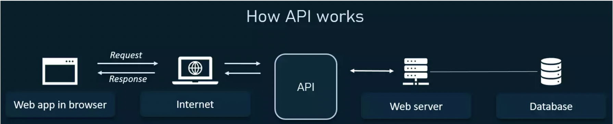

# Data Gathering

### Sources of Data
---

1. [Twitter (R API)](https://www.rdocumentation.org/packages/twitteR/versions/1.1.9)
2. [News Media (Python API)](https://newsapi.org/docs/client-libraries/python)
3. [REKT Database Public API - The largest database of crypto hacks, scams, exploits and rug pulls](https://github.com/defiyield-app/api-docs/blob/main/README_Rekt_Database.md)

### Tools Used to Gather Data
---

For this project, data will be collected using Python, R, and Google Chrome Extensions* (see point #2) through:

1. APIs: Application Programming Interface
- Used to refer to libraries used internally by respective organizations
- Now hijacked by developers to mean interface to access external data
- Most web-based services have a public-facing API (Twitter, Amazon,
Google, Spotify, etc)
- Having used the twitteR API in the Bootcamp, I could easily scrape just more than a 1000 tweets with the query "crypto + crime". I did clean the [data](https://github.com/anly501/anly-501-project-TegveerG/tree/main/data/R_Twitter_API) using the same functions from the Bootcamp assignments and, eventually, got left with a dataset of about 500 observations. I shall revisit my data cleaning procedure again and, importantly, I do have my raw tweets file saved.
- The NEWSAPI was easy to follow and I obtained content from a hundred articles. However, playing around with the query parameter to obtain relevant articles was a bit time-consuming. I tried several queries with logical operators but I obtained no responses. I, then, only queried for the word "crypto" and found several relevant articles that described crypto attacks. I will hold onto this [CSV file](https://github.com/anly501/anly-501-project-TegveerG/tree/main/data/Python_News_API) for now but I may discard it later because I came across a very potent database, tailored exactly to my topic (read below!)
- While brainstorming data sources for my project, I only had popular social media and news media sources in mind. Surfing the web for hours with key words pertaining to my topic was indispensable to coming across to the REKT Database offered by [Defiyield App](https://defiyield.app/). As per Defiyield, this is the largest database of crypto hacks, including scams, exploits and rug pulls etc. The database, when not filtered, includes 3049 observations, all of which are linked to some kind of crypto attack. Some of the main fields that I wish to include my analysis are dollar funds lost and returned, description of the crime (synopsis provided by Defiyield along with links to news sources for proof of issue occurrence), crypto token(s) and exchanges affected by the issue, and type of scam. I did access the API through Postman and got [responses for the first 100 observations](https://github.com/anly501/anly-501-project-TegveerG/tree/main/data/Postman_REKT_Database_API), but I am yet to write Python code to paginate through all pages of the database.

2. *Instant Web Scraping Extension 
- I employed this to play around with the REKT Database website. I was successful in obtaining all but one (very important) field of the database, description of attack. However, I shall soon employ the REKT Database API in Python to obtain the complete database! The Instant Web Scraping Extension is only a short-term fix to getting my hands dirty while obtaining data. Eventually, after using the extension, I produced a [CSV file](https://github.com/anly501/anly-501-project-TegveerG/tree/main/data/Data_Scraper_Chrome_Extension) of about 3000 observations and 7 variables. 

