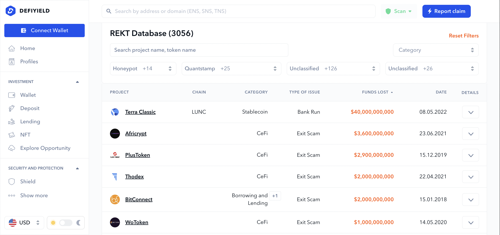
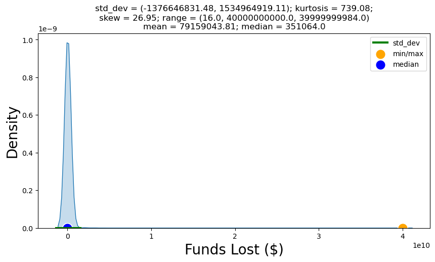
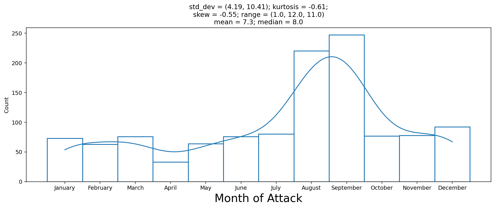
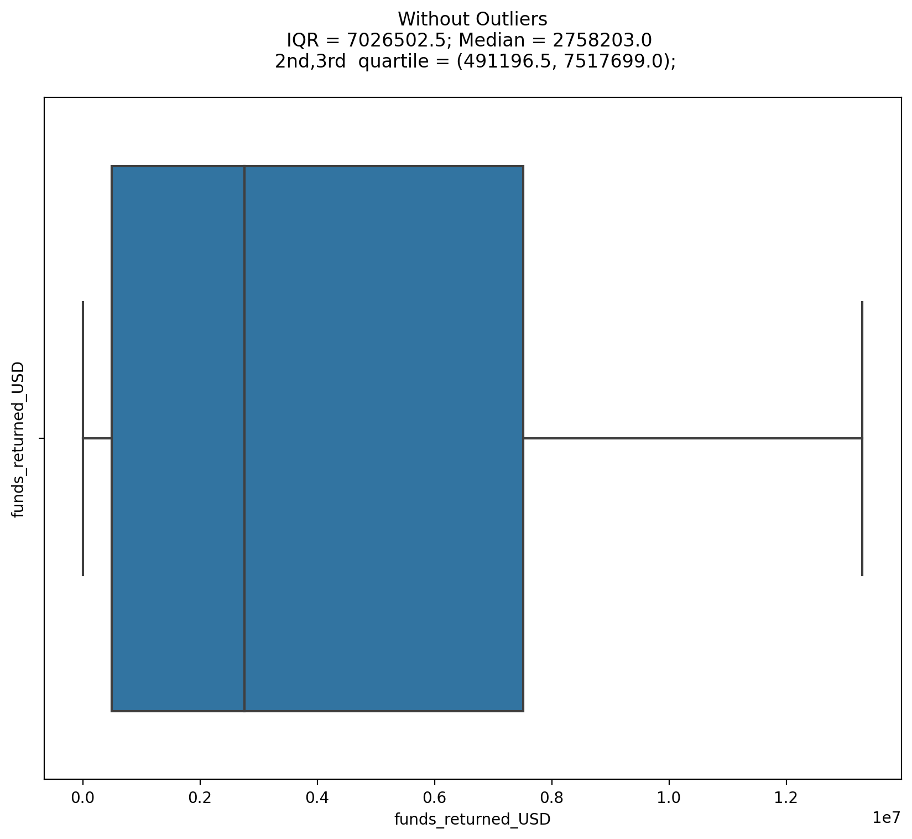
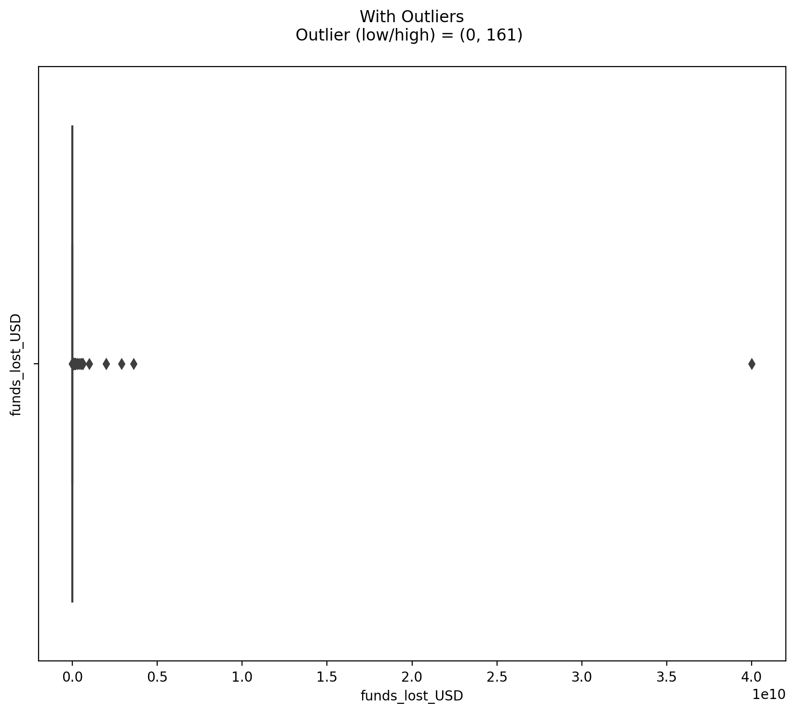
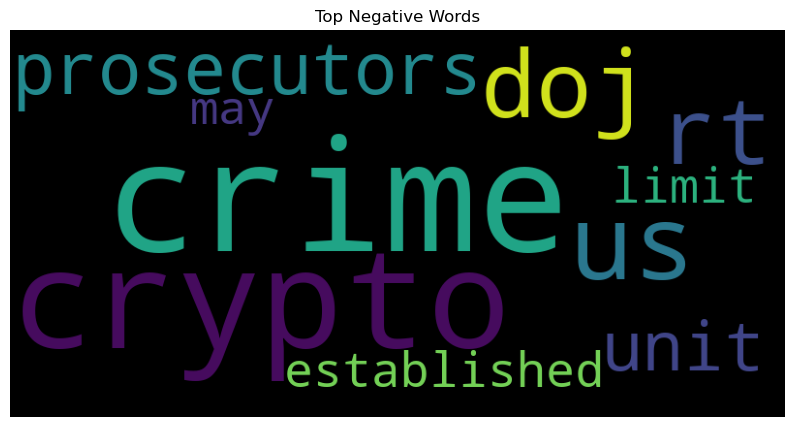

# Exploring Data
---

## Data To Be Explored
---

1. [REKT Database](https://github.com/anly501/anly-501-project-TegveerG/blob/main/codes/Exploring_Data/EDA_REKT_Record_Data.ipynb)

2. [Twitter API](https://github.com/anly501/anly-501-project-TegveerG/blob/main/codes/Data_Cleaning/Twitter_API_cleaning.ipynb)

3. News API (https://github.com/anly501/anly-501-project-TegveerG/blob/main/codes/Data_Cleaning/Twitter_API_cleaning.ipynb)

## REKT Database Univariate Analysis: Numerical Variables
---

The REKT Database is our record data, which contains a mix of both numeric and categorical variables. Univariate analysis has been conducted on both numeric and categorical variables. The univariate analysis for numeric variables includes showcasing the moments, including median, skewness, and range, of the funds returned and funds lost variables. We also show that by log-transforming both the funds variables, we obtain an approximate Normal Distribution (bell-curve shape) for each variable.

Moreover, outlier detection through boxplots is showcased for the funds variables (not log- transformed).

**Applying Log Normal Transformation to both Funds Variables, we get an ideal fit for our data with no skewness or kurtosis present:**

## REKT Database Univariate Analysis: Categorical Variables
---

The univariate analysis for categorical variables, including extracted datetime features and scam type, showcases the distribution of when attacks took place, particularly in which months and day of the week. The scam type variable 14 unique categories or types of attacks that have been recorded in the REKT Database. For exploration, we highlight which scams are most prevalent in the data

## REKT Database Univariate Analysis: Outlier Detection
---

## REKT Database Bivariate Analysis : Numerical-Numerical
---

In this section, we dive into the correlations of each numeric variable with each other using a correlation matrix. We can see that funds returned and funds lost are moderately correlated around 0.5 as their pearson correlation coefficient. This signifies that funds were not always returned for each attack! In fact, upon cleaning the dataset further by eliminating those projects that were disbanded or deactivated, more than 90% of the dataset contains no funds returned values. Therefore, when funds were returned, they must be returned in accordance with the magnitude of the loss.

## Twitter Sentiment Analysis from Vader
---

In this section, we build wordclouds for positive and negative sentiment words from our twitter corpus. 

