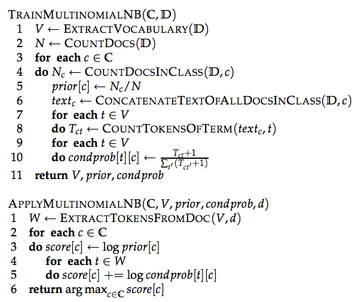
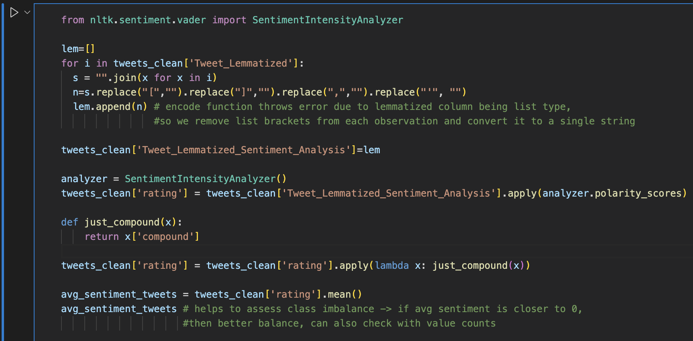
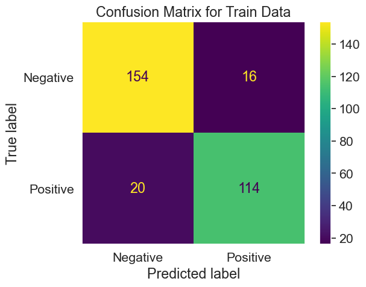
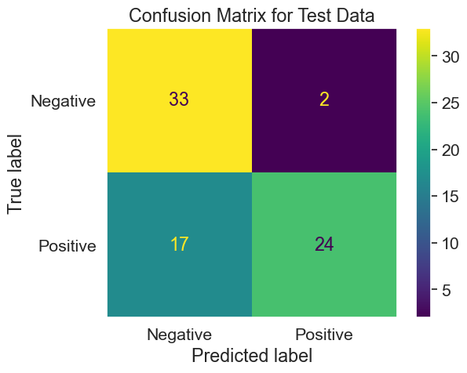
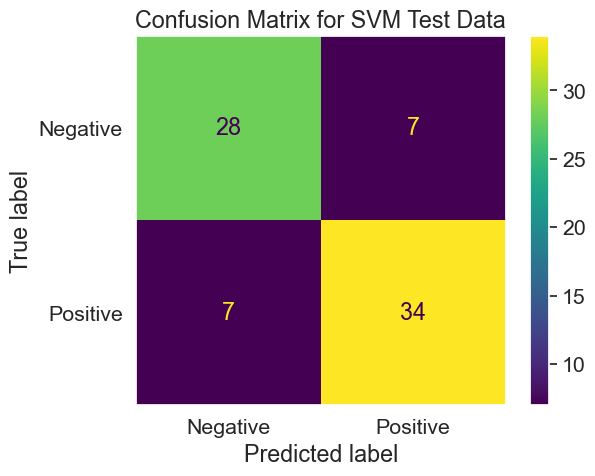

## Process Flow of Multinomial Naive Bayes:

[](https://stackoverflow.com/questions/36835094/understanding-algorithm-multinomial-naive-bayes)

Table 1: Links to Github Repository
---
```{r create_tbl, echo=FALSE, message=FALSE}
library(gt)
library(tidyverse)

df <- tibble(
  Codes_and_Data = c("Naive Bayes Python Code", "Clean Tweets", "Clean News", "Naive Bayes R Code", "Clean Record Data"),
  link = c("https://github.com/anly501/anly-501-project-TegveerG/tree/main/codes/Naive_Bayes_py", "https://github.com/anly501/anly-501-project-TegveerG/blob/main/data/Clean%20Data/Clean_TokeLemm_Crypto_Tweets.csv", "https://github.com/anly501/anly-501-project-TegveerG/blob/main/data/Clean%20Data/Clean_TokeLemm_News.csv", "https://github.com/anly501/anly-501-project-TegveerG/tree/main/codes/Naive_Bayes_R", "https://github.com/anly501/anly-501-project-TegveerG/blob/main/data/Clean%20Data/REKT_Database_Clean_Python.csv"))

# using html
df %>%
    mutate(Link = glue::glue("[Github]({link})"),
        Link = map(Link, gt::md)) %>% select(Codes_and_Data, Link) %>%
    gt()
```


Multinomial Naive Bayes in R (REKT Database Record Data)
---

```{r init, messages=FALSE,echo=FALSE, include=FALSE} 
library(naivebayes)
library(klaR)
library(e1071)
library(caTools)
library(caret)
library(tidyverse)
```

```{r import, message=FALSE,echo=FALSE} 
df <- read_csv('../../data/Clean Data/REKT_Database_Clean_Python.csv') 
df <- subset(df, select = -c(...1, token_addresses, network))  
```

```{r cleanscamtype,echo=FALSE} 
# Removing dictionary values from the scam_type column
df$scam_type <- gsub("[^:]*,[^:]*", "",df$scam_type)
df$scam_type <- gsub("'id'::", "",df$scam_type)
df$scam_type <- gsub("\\{|\\}", "",df$scam_type)
df$scam_type <- gsub("'", "",df$scam_type)
df$scam_type <- gsub("type: ", "",df$scam_type)
df$scam_type <- gsub(" ", "",df$scam_type)
```

```{r cleanscamNetworks, message=FALSE, warning=FALSE,echo=FALSE} 
# Removing list brackets from the scamNetworks column
df$scamNetworks <- gsub("\\[|\\]", "", df$scamNetworks)
df$scamNetworks <- gsub("'", '', df$scamNetworks)
# imputing the missing values as "Other"
df$scamNetworks[df$scamNetworks==""] <- "Other"
# Split df by scamNetworks feature that has multiple categorical values for respective rows 
library(splitstackshape)
df2 <- concat.split.multiple(data = df, split.cols = "scamNetworks", direction = "long")
```

Let’s first calculate the frequency of response variable to see if it is imbalanced.

```{r cleanX,echo=FALSE} 
# Funds returned NA's to 0, funds lost NAs drop
#Let’s calculate the frequency of response variable to see if it is imbalanced. The minimum frequency of #each class is 5 required for analysis.

as.data.frame(xtabs(~scam_type, data = df2))
```

If the funds lost is $0, that means the respective observation or record has not much information to offer to us in terms of a Naive Bayes Model. Also, if no funds were lost then no funds can be returned/recovered. Therefore, filtering out the 0 funds_lost observations makes sense if we want balanced classes for our predictor, scam type. 

```{r zerofundslost, echo=FALSE, include=FALSE} 
nrow(df2 %>% filter(funds_lost==0))
nrow(df2 %>% filter(funds_returned==0))
```

```{r filterscams, echo=FALSE} 
df2 <- df2 %>% filter(funds_lost!=0)

as.data.frame(xtabs(~scam_type, data = df2))
```

After filtering out the $0 funds_lost values, 1861 honeypots, 383 rugpulls, and 29 "other" scams are dropped in the process of treating class imbalance. Moreover, no key information, in terms of funds lost or source of the attack, is offered about these removed attacks. We are left with all those rows where funds lost != 0 and where all crypto projects have some key information to offer regarding the extent of the scam, which will be useful in predicting the scam type.

Now we have all records where funds lost != 0 and predictor with balanced classes

As per REKT Database, Honeypot attacks, Rugpull attacks, Abandoned scams, and the Kronos Dao project (classified as "other") can be pooled together as Exit Scams and all other attacks can be pooled together as Exploits. We, therefore, will conduct Naive Bayes with a binary predictor. Moreover, after pooling together the respective scam types and treating predictor imbalance, the class frequencies of our desired target variable is: n(Exit Scam) = 380 and n(Exploit) = 435

We shall also take log of funds_lost and funds_returned to obtain normal distribution assumption for Naive Bayes as well as for better prediction accuracy.

```{r logfunds, echo=FALSE} 
# Removing dictionary values from the source column
df2$log_funds_lost <- log(df2$funds_lost)
df2$log_funds_returned <- log(df2$funds_returned + 1) # add +1 because we have zeros in funds_returned and helps avoid negative inf values
```

```{r subset, echo=FALSE} 
# Removing dictionary values from the source column
data_nb <- subset(df2, select = c(project_name, log_funds_lost, log_funds_returned, scamNetworks, month_of_attack, day_of_week_of_attack, day_of_year_of_attack, scam_type))  
```

After pooling together the scam types into respective types as described above:

```{r combinescamtype, echo=FALSE} 
data_nb %>% group_by(scam_type) %>% summarise(num_occurences=n()) 
# pooling together scam types into respective types as described above
data_nb <- data_nb %>% 
  mutate(scam_type_grouped = if_else(scam_type=="Honeypot" | scam_type=="Rugpull" | scam_type=="Abandoned" | project_name=="Kronos Dao", "Exit Scam", "Exploit"))
data_nb <- subset(data_nb, select = -c(project_name, scam_type))
data_nb %>% group_by(scam_type_grouped) %>% summarise(num_occurences=n()) 
```


```{r specifytypes, echo=FALSE} 
data_nb$log_funds_lost <- as.double(data_nb$log_funds_lost)
data_nb$log_funds_returned <-as.double(data_nb$log_funds_returned)
data_nb$scamNetworks <- as.factor(data_nb$scamNetworks)
data_nb$month_of_attack <- as.factor(data_nb$month_of_attack)
data_nb$day_of_week_of_attack <-as.factor(data_nb$day_of_week_of_attack)
data_nb$day_of_year_of_attack <- as.integer(data_nb$day_of_year_of_attack)
data_nb$scam_type_grouped <-as.factor(data_nb$scam_type_grouped)
data_nb <- data_nb[sample(1:nrow(data_nb)), ] # shuffle rows
```

```{r traintestsplit, echo=FALSE} 
set.seed(1234)
ind <- sample(2, nrow(data_nb), replace = T, prob = c(0.8, 0.2))
train <- data_nb[ind == 1,]
test <- data_nb[ind == 2,] 
```

```{r trainnbmodel, echo=FALSE, include=FALSE} 
model <- naive_bayes(scam_type_grouped ~ ., data = train) 
plot(model)
```

```{r trainpred, echo=FALSE, include=FALSE} 
p <- predict(model, train, type = 'prob')
head(cbind(p, train))
```

```{r ggplotConfusionMatrix, warning=FALSE, echo=FALSE, include=FALSE} 
#credit: https://stackoverflow.com/questions/46063234/how-to-produce-a-confusion-matrix-and-find-the-misclassification-rate-of-the-na%C3%AF

library(scales)
ggplotConfusionMatrix <- function(m){
  mytitle <- paste("Accuracy", percent_format()(m$overall[1]))
  p <-
    ggplot(data = as.data.frame(m$table) ,
           aes(x = Prediction, y = Reference)) +
    geom_tile(aes(fill = log(Freq)), 
              colour = "white", show.legend = FALSE) +
    scale_fill_gradient(low = "white", high = "steelblue") +
    geom_text(aes(x = Prediction, y = Reference, 
                  label = Freq, show.legend = FALSE)) +
    ggtitle(mytitle) + 
    scale_x_discrete(limits = rev) +
    theme_minimal()
  return(p)
}
```

### Confusion Matrix for Training Data:

```{r confmatrixtrain, warning=FALSE, echo=FALSE, results='hide', fig.keep='all'} 
set.seed(4938)
train_preds <- predict(model, train)
#(tab1 <- table(train_preds, train$scam_type_grouped))
cfm_train <- confusionMatrix(train_preds, train$scam_type_grouped)
ggplotConfusionMatrix(cfm_train)
cfm_train
```

### Confusion Matrix for Test Data:

```{r confmatrixtest, warning=FALSE, echo=FALSE,results='hide', fig.keep='all'} 
test_preds <- predict(model, test)
#(tab2 <- table(test_preds, test$scam_type_grouped))
cfm_test <- confusionMatrix(test_preds, test$scam_type_grouped)
ggplotConfusionMatrix(cfm_test)
cfm_test
```

### Discretizing log funds features and day of year feature for more accurate predictions:

### Confusion Matrix for Discretized Training Data:

```{r discretizedtrain, warning=FALSE, message=FALSE, echo=FALSE,results='hide', fig.keep='all'} 
library(arules)
set.seed(2838)
x = subset(data_nb, select = -c(scam_type_grouped))  
Scam_Type = as.factor(data_nb$scam_type_grouped)

Disc_log_funds_lost = discretize(x$log_funds_lost, method = "cluster", breaks = 3)
Disc_log_funds_returned = discretize(x$log_funds_returned, method = "cluster", breaks = 3)
Disc_day_of_year_of_attack = discretize(x$day_of_year_of_attack, method = "cluster", breaks = 3)

Ddf = data.frame(Disc_log_funds_lost, Disc_log_funds_returned, x$scamNetworks, x$month_of_attack, x$day_of_week_of_attack, Disc_day_of_year_of_attack, Scam_Type)

ind <- sample(2, nrow(Ddf), replace = T, prob = c(0.8, 0.2))
train_discretized <- Ddf[ind == 1,]
test_discretized <- Ddf[ind == 2,] 

discretized_NB_model <- NaiveBayes(Scam_Type ~ ., data=train_discretized) 

cfm_discretized_train <- confusionMatrix(predict(discretized_NB_model, train_discretized)$class, train_discretized$Scam_Type)

ggplotConfusionMatrix(cfm_discretized_train)
cfm_discretized_train
```

### Confusion Matrix for Discretized Test Data:

```{r discretizedtest, warning=FALSE, message=FALSE, echo=FALSE,results='hide', fig.keep='all'} 
cfm_discretized_test <- confusionMatrix(predict(discretized_NB_model, test_discretized)$class, test_discretized$Scam_Type)
ggplotConfusionMatrix(cfm_discretized_test)
cfm_discretized_test
```

Multinomial Naive Bayes in Python using Text Data from NewsAPI and Twitter API
---

To make the task more interesting, I will also feature engineer a Sentiment Score for each text content, tweets and news, to create 2 labels: Positive and Negative. 

### Twitter Sentiment Analysis for Feature Engineering 

Average Sentiment of All Tweets is -0.39 (rounded to 2 dp), which implies there are more negative words associated with crypto attacks in tweets. The value_counts() below also confirms this as we have 177 negative tweets and 111 positive tweets. To conduct Naive Bayes fairly, I would typically want a more balanced class of labels, let's see what the overall sentiment is for news articles and hope it is relatively more positive to gain balanced classes



### News Sentiment Analysis for Feature Engineering 

As mentioned in the tweets section, in the news section we obtain a more positive overall sentiment. This will help balance our target variable as we will combine the tweets and news articles into 1 dataframe for Naive Bayes to predict either Positive or Negative Sentiment.  

### Multinomial Naive Bayes on Merged News and Twitter Text



Accuracy score for Train Predictions:  0.88 \n\n

Recall score for Train Predictions:  0.88 \n\n

Precision score for Train Predictions:  0.88 \n\n

F1 score for Train Predictions:  0.88 



Accuracy score for Test Predictions:  0.75 \n\n

Recall score for Test Predictions:  0.75 \n\n

Precision score for Test Predictions:  0.80 \n\n

F1 score for Test Predictions:  0.74


### Going Above and Beyond: Linear SVM



Accuracy score:  0.82 \n\n

Recall score:  0.82 \n\n

Precision score:  0.82 \n\n

F1 score:  0.82 \n\n

Discussion and Conclusions
---

### Advantages of Naive Bayes
 
1. Can handle missing values
Missing values are ignored while preparing the model and ignored when a probability is calculated for a class value.
2. Can handle small sample sizes.
Naive Bayes does not require a large amount of training data. It merely needs enough data to understand the probabilistic relationship between each attribute in isolation with the target variable. If only little training data is available, Naive Bayes would usually perform better than other models.
3. Performs well despite violation of independence assumption
Even though independence rarely holds for real world data, the model will still perform as usual.
4. Easily interpretable and has fast prediction time in comparison.
Naive Bayes is not a black-box algorithm and the end result can be easily interpreted to an audience.
5. Can handle both numeric and categorical data.
Naive Bayes is a classifier and will therefore perform better with categorical data. Although numeric data will also suffice, it assumes all numeric data are normally distributed which is unlikely in real world data.
 

### Disadvantages of Naive Bayes
 
1. Naive Assumption
Naive Bayes assumes that all features are independent of each other. In real life it is almost impossible to obtain a set of predictors that are completely independent of each other.
2. Cannot incorporate interactions between the features.
The model's performance will be highly sensitive to skewed data.
When the training set is not representative of the class distributions of the overall population, the prior estimates will be incorrect.
3. Zero Frequency problem
Categorical variables that have a category in the test data but was not in the training data will be assigned a probability of zero (0) and will be unable to make a prediction.
As a solution, a smoothing technique must be applied to the category. One of the simplest and most famous techniques is the Laplace Smoothing Technique. Python's Sklearn implements laplace smoothing by default.
Correlated features in the dataset must be removed or else are voted twice in the model and will over-inflate the importance of that feature.
4. It heavily relies on the prior target class probability for predictions. Inaccurate or unrealistic priors can lead to misleading results. Because Naive Bayes is a probability based machine learning technique, the probability of the target will greatly affect the final prediction.

All of the above can be used as valid points that other classifiers should be built to outperform the Naive Bayes model. While Naive Bayes is great for spam filtering and Recommendation Systems, it is probably not ideal in most other applications.

Overall Naive Bayes is fast, powerful and explainable. However, the major dependence on the prior probability of the target variable can create misleading and inaccurate results. Classifiers such as Decision Trees, SVM, Random Forests and Ensemble methods are able to outperform Naive Bayes. However, the above point does not undermine the effectiveness of Naive Bayes as a reliable classifier. The independence assumption, inability to handle interactions between features, and normality assumption make Naive Bayes's predictions hard to trust.

External References
---

https://www.kdnuggets.com/2019/04/naive-bayes-baseline-model-machine-learning-classification-performance.html/2

https://stackoverflow.com/questions/46063234/how-to-produce-a-confusion-matrix-and-find-the-misclassification-rate-of-the-na%C3%AF
