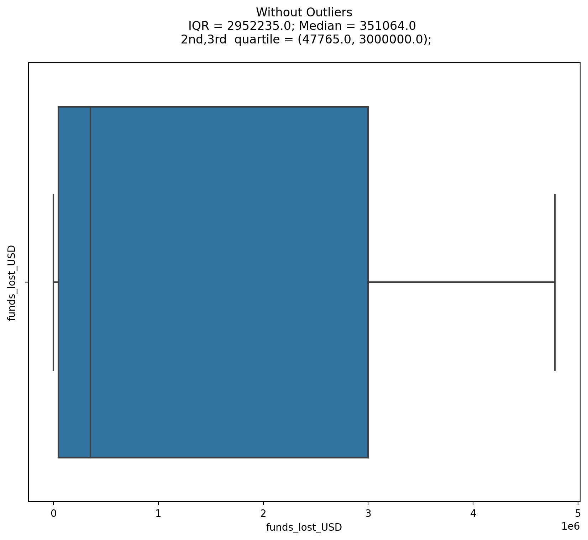
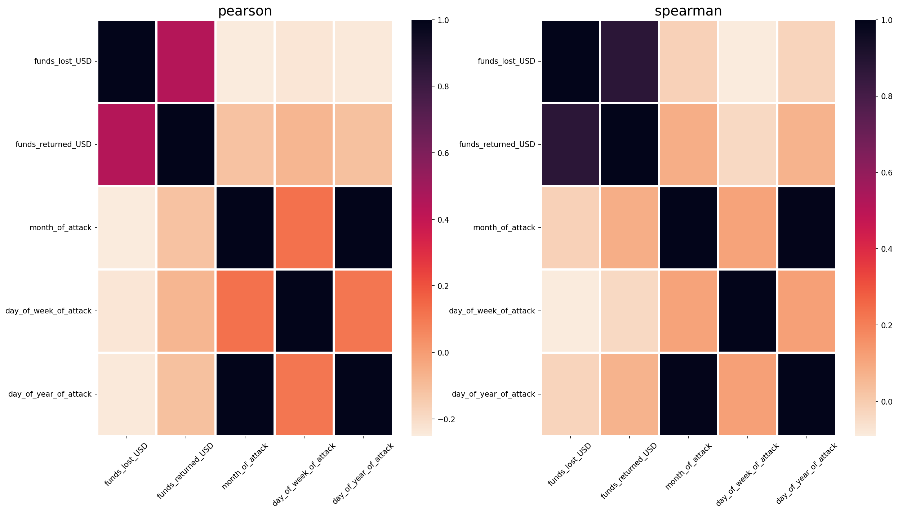
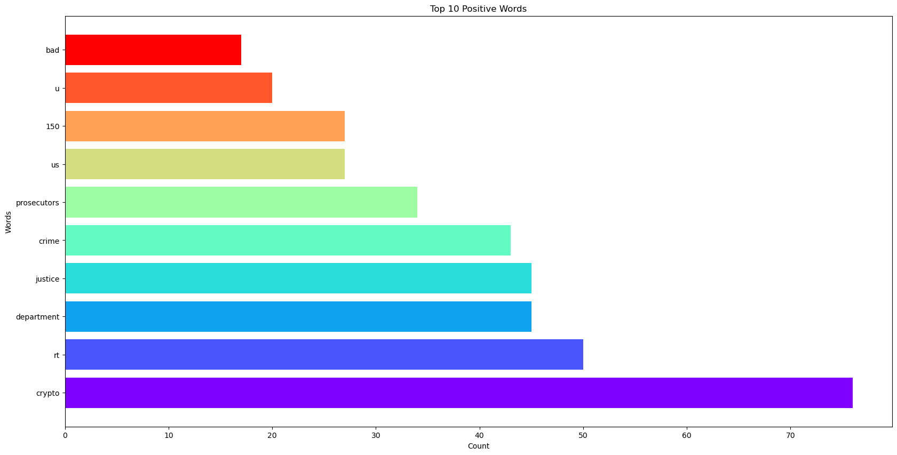

Multinomial Naive Bayes in R (REKT Database Record Data) and Python (Twitter and News Text)
---

       

<table>
<caption>Table 1: Links To Code in Github</caption>

Python                                R
-------------                         ---------
[Code] (www.bit.ly/1EqAdIp)          ipsum
dolor          sit

</table>

REKT Database Univariate Analysis: Numerical Variables
---

**Applying Log Normal Transformation to both Funds Variables, we get an ideal fit for our data with no skewness or kurtosis present:**

REKT Database Univariate Analysis: Categorical Variables
---

REKT Database Univariate Analysis: Outlier Detection
---

REKT Database Bivariate Analysis : Numerical-Numerical
---

Twitter Sentiment Analysis from Vader
---

Advantages of Naive Bayes
 

Can handle missing values
Missing values are ignored while preparing the model and ignored when a probability is calculated for a class value.
Can handle small sample sizes.
Naive Bayes does not require a large amount of training data. It merely needs enough data to understand the probabilistic relationship between each attribute in isolation with the target variable. If only little training data is available, Naive Bayes would usually perform better than other models.
Performs well despite violation of independence assumption
Even though independence rarely holds for real world data, the model will still perform as usual.
Easily interpretable and has fast prediction time in comparison.
Naive Bayes is not a black-box algorithm and the end result can be easily interpreted to an audience.
Can handle both numeric and categorical data.
Naive Bayes is a classifier and will therefore perform better with categorical data. Although numeric data will also suffice, it assumes all numeric data are normally distributed which is unlikely in real world data.
 

Disadvantages of Naive Bayes
 

Naive Assumption
Naive Bayes assumes that all features are independent of each other. In real life it is almost impossible to obtain a set of predictors that are completely independent of each other.
Cannot incorporate interactions between the features.
The model's performance will be highly sensitive to skewed data.
When the training set is not representative of the class distributions of the overall population, the prior estimates will be incorrect.
Zero Frequency problem
Categorical variables that have a category in the test data but was not in the training data will be assigned a probability of zero (0) and will be unable to make a prediction.
As a solution, a smoothing technique must be applied to the category. One of the simplest and most famous techniques is the Laplace Smoothing Technique. Python's Sklearn implements laplace smoothing by default.
Correlated features in the dataset must be removed or else are voted twice in the model and will over-inflate the importance of that feature.
 

Why use Naive Bayes as a baseline Classifier for performance?
My thoughts as to why Naive Bayes should be the first model to create and compare is that:

It heavily relies on the prior target class probability for predictions. Inaccurate or unrealistic priors can lead to misleading results. Because Naive Bayes is a probability based machine learning technique, the probability of the target will greatly affect the final prediction.
Since you do not have to remove missing values, you will not have to risk losing any of your original data.
The independence assumption is practically never satisfied and therefore the results are not very trustworthy since its most basic assumption is flawed.
Interactions between features are not accounted for in the model. However features in the real world almost always have interactions.
There is no error or variance to minimize but only to seek the higher probability of a class given the predictors.
All of the above can be used as valid points that other classifiers should be built to outperform the Naive Bayes model. While Naive Bayes is great for spam filtering and Recommendation Systems, it is probably not ideal in most other applications.

Conclusion
Overall Naive Bayes is fast, powerful and interpretable. However, the overreliance on the prior probability of the target variable can create very misleading and inaccurate results. Classifiers such as Decision Trees, Logistic Regression, Random Forests and Ensemble methods should be able to outperform Naive bayes to be an actually useful. This is is no way removes Naive Bayes as a powerful classifier. The independence assumption, inability to handle interactions, and gaussian distribution assumption make it a very difficult algorithm to trust with prediction on its own as these models will have to be continuously upated.

https://www.kdnuggets.com/2019/04/naive-bayes-baseline-model-machine-learning-classification-performance.html/2
